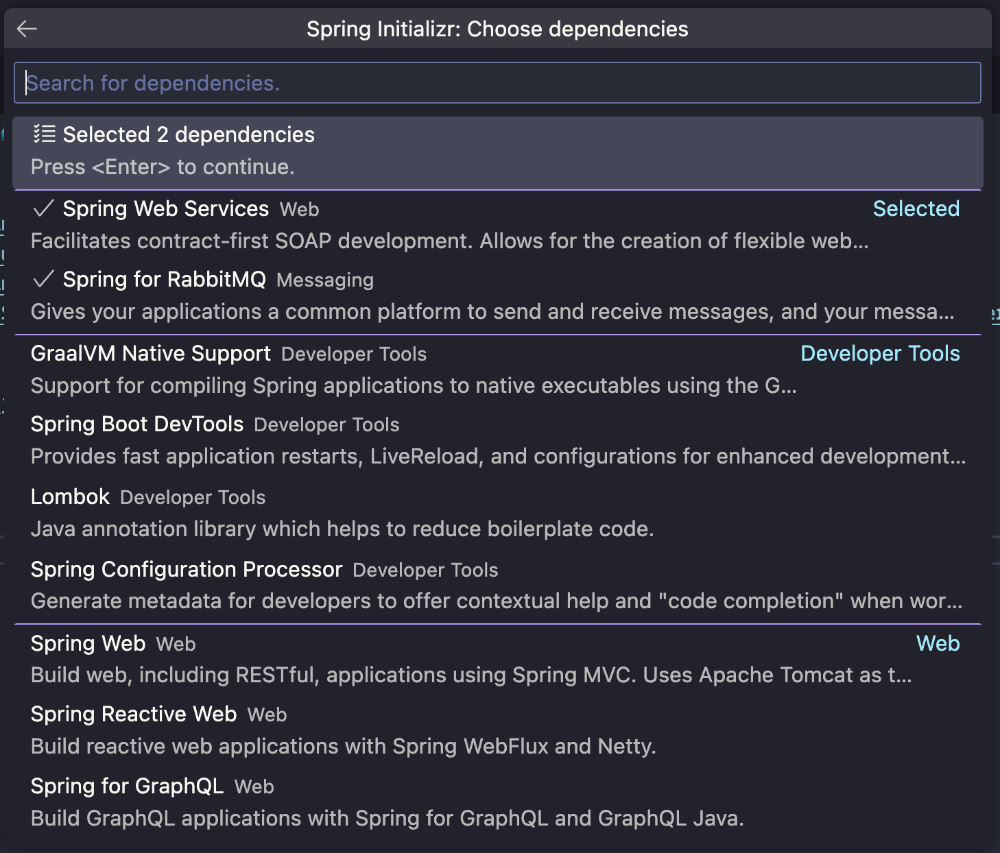
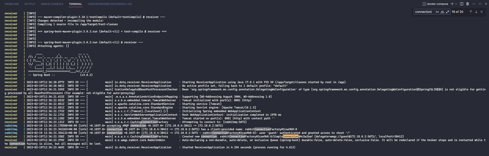
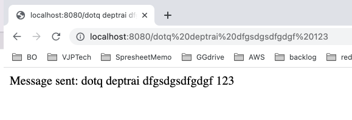

# rabbitmq-spring-boot-docker-microserv 🐳


[](https://github.com/tquangdo/rabbitmq-spring-boot-docker-microserv/issues/new)

## reference
[youtube](https://www.youtube.com/watch?v=DvZVFQFjzsQ)

## version
```shell
java -version
# openjdk version "17.0.2" 2022-01-18
# OpenJDK Runtime Environment Temurin-17.0.2+8 (build 17.0.2+8)
mvn -version
# Apache Maven 3.8.5 (3599d3414f046de2324203b78ddcf9b5e4388aa0)
# Maven home: /opt/homebrew/Cellar/maven/3.8.5/libexec
```
- need to map with `sender/Dockerfile` & `receiver/Dockerfile`
```bash
FROM maven:3.8.3-openjdk-17
```

## create project
- create spring boot project: `sender` & `receiver`


## src code
1. ### Receiver.java
    - refer [Create a RabbitMQ Message Receiver](https://spring.io/guides/gs/messaging-rabbitmq/)
1. ### ReceiverApplication.java
    - refer [Register the Listener and Send a Message](https://spring.io/guides/gs/messaging-rabbitmq/)
1. ### Sender.java
    - refer [Send a Test Message](https://spring.io/guides/gs/messaging-rabbitmq/)

## demo
```shell
docker-compose up --build
```
- will see `create new connection rabbitMQ...`

- access `localhost:8080` will see default page of spring boot
- access `localhost:8080/dotq deptrai dfgsdgsdfgdgf 123` will see `receiver    | Received <dotq deptrai dfgsdgsdfgdgf 123>` in terminal and in browser will be:

